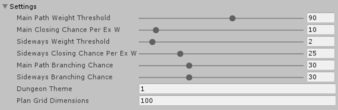
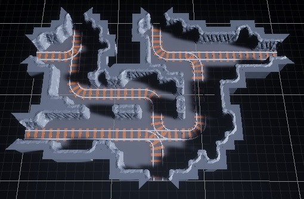
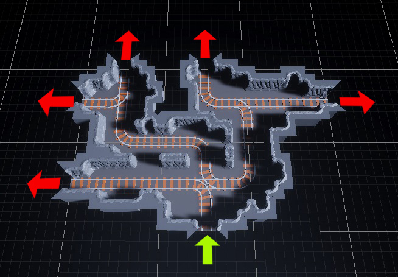
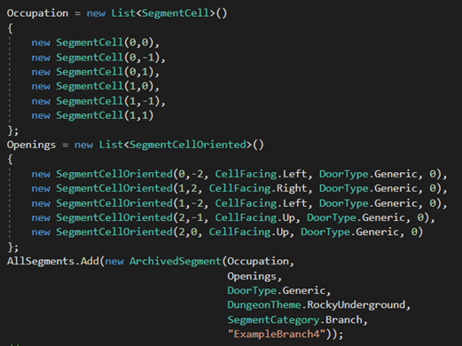
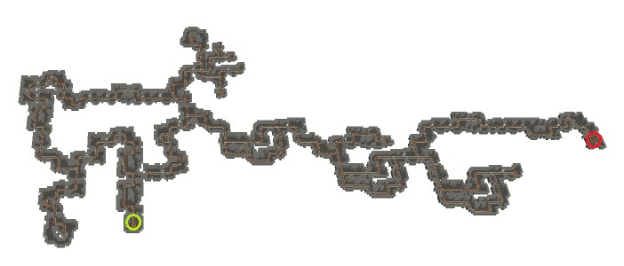
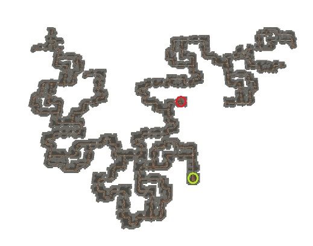
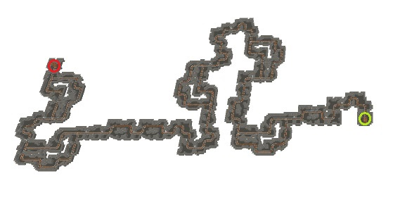
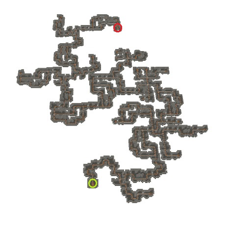

# Residue-Dungeon-Generator
## Segment-based runtime level generator for Unity
Residue Dungeon Generator is a Unity module designed to map out and build segment-based dungeons at runtime. Shape, complexity, length, and linearity of the dungeon are defined by generation settings while user retains full control over individual segment’s design including shape, decorations, events, enemy spawns, etc.  

## How it works:
User designs and registers a number of possible game level pieces (cave sections/castle rooms/underground ruins). This module then can be used mid-game to generate a full level with specified length and complexity. The structure plan is arranged in a tree so that the user was able to modify sequences of segments prior to building.  

## Generation settings:  

- **MainPathWeightThreshold** – Minimum main path weight (sum of cells occupied by all segments that constitute a main path) needed for main path closing chance to take effect. Larger values generally mean a longer path between dungeon entrance and exit.  
- **MainClosingChancePerExW** – Percent chance per weight after threshold that next segment in main path sequence will end it and generate an exit. Low values produce dungeons with highly variable lengths while higher ones bring the length closer to the threshold.
- **SidewaysWeightThreshold** – Minimum weight of the sideway starting from the point of branching from the main path before sideways closing chance takes effect.
- **SidewaysClosingChancePerExW** - Percent chance per weight after threshold that next segment in a sideway will generate a dead-end.
- **MainPathBranchingChance** – Percent chance for the segment in the main path to be a branch with sideways. Lower values generate less complex and more linear dungeons.
- **SidewaysBranchingChance** – Percent chance for the segment in a sideway to branch further. High branching chance in conjunction with high sideways threshold increase sideway complexity exponentially due to recursive branching and should be used with caution.
- **DungeonTheme** – Code number for the pool of possible segments to choose from. Can be utilized to have multiple dungeon themes/levels.
- **PlanGridDimensions** – Size of the side of the 2D grid, which is used to register space occupied by segments and detect their intersections. Can be increased in case of high plan generation failure rate because extremely long linear or bulky dungeons get out of bounds.  

### Pros:  
Segment intersection detection and generation of complete dungeon plan in general are done without involving physics engine or Unity game objects manipulations. As a result, this module is resistant to being broken one day after game engine update because of redesigned/removed methods of collider intersection detection or game objects interactions. 
Because dungeon layout generation is done “on paper” prior to actually generating anything in the world, algorithm’s design is solely responsible for its performance and allows generating hundreds of mid to high complexity layout plans in one update without frame rate drop. 
Grid-based segment dimensions measurement greatly reduces amount of information needed to register a new dungeon segment and simplifies calculations to determine a possibility to fit a segment in a given space in dungeon. Due to entrances/exits located on the edges of the grid, multiple segments can easily be joined in a loop and registered as a new segment.

### Cons:  
Uninvolving Unity physics engine and game objects in the process of detecting segment intersections shifts the necessity of measuring segment dimensions onto the user. After designing the segment, one needs to register it in a pool of possible segments, specify its shape and entrances/exits locations.
Grid structure of segment occupation in dungeon layout restricts possible entrances/exits locations to the edges but greatly simplifies the measurement and registration process, generally taking less than a couple of minutes.

## Adding new segments  
Example segment:  
  
This segment occupies six cells (Unity’s grid can be adjusted to match the one used to design a segment) and has six openings so this segment branches the dungeon.  All openings are connectible, of the same type(generic) and have same altitude (0). Occupation grid’s origin is the cell with entrance (faced down) so this segment can be mapped like this:  
  
The above information then can be added to the static constructor of the SegmentCodex (template can be used):  
  
For each of its exits module automatically generates additional entrance-displaced subvariants, of this segment rotated and moved so that every exit can be an entrance. For every segment and its subvariants additional rotations are applied and saved to account for possible dungeon orientation. This is done once beforehand to save calculations in the middle of dungeon generation.  

## Example dungeons: 
Resources folder contains 15 placeholder segment assets. View from above; entrance and exit are marked by green and red circles respectively.  
### Average result with default settings:  
  
  
### Low main path threshold with very high sideways threshold:  
  
  
### Linear dungeon with very low branching chance:  
  
  
### Very high branching chance and high main path threshold:  
  

